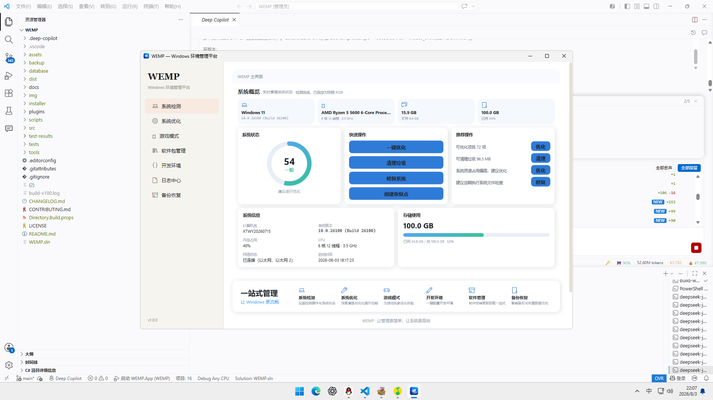
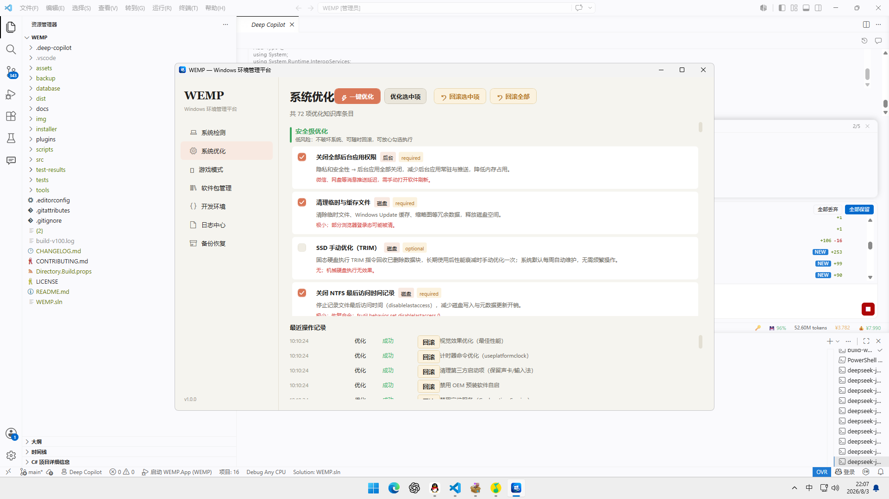

# WEMP — Windows Environment Management Platform

Windows 环境管理平台：一个面向 Windows 的集成化环境管理工具，将系统优化、游戏模式、开发环境配置、软件包管理、系统备份恢复、日志管理六大能力统一到一个平台中。


## 功能

- **系统优化**：知识库驱动的 20 类优化项（服务、注册表、启动项、网络、磁盘、电源、内存、游戏、Appx、后台应用、GPU、HAGS、页面文件、计划任务、Windows 功能等），safe / medium / advanced 三级风险标注，统一 备份 → 应用 → 回滚 三阶段，优化前自动创建系统还原点
- **游戏模式**：自动检测游戏会话，进入时切换高性能电源并释放后台进程，退出自动恢复；会话计时与历史记录；支持自定义游戏库
- **开发环境**：30+ 语言/工具链 YAML 模板一键部署（Node.js / Python / Java / Go / Rust / Docker / Git / VS Code / 数据库 / 嵌入式等），含环境变量、配置文件、验证与快照回滚
- **软件包管理**：winget 适配，软件同步、分组批量安装、一键升级
- **备份与恢复**：任务化全量/增量文件备份，按记录还原
- **日志中心**：操作审计查询与统计、Windows 事件日志聚合、异常规则扫描与处置

## 截图

| 主界面 | 系统优化 |
|--------|----------|
|  |  |

## 安装

### 系统要求

- Windows 10 22H2+ 或 Windows 11（x64）
- 建议 .NET 8 运行时（自包含安装包无需预装）
- 执行系统级优化建议以管理员身份运行

### 安装包

从 [Releases](https://github.com/ky2421/Windows-Environment-Management-Platform-WEMP-/releases) 下载 `WEMP-1.0.0-setup.exe`，双击运行并按向导完成安装。安装后可通过开始菜单或桌面快捷方式启动。

### 卸载

通过 Windows 设置 → 应用 → 已安装的应用 → WEMP → 卸载，或运行安装目录下的 `unins000.exe`。卸载会移除程序文件、快捷方式与卸载注册项；个人数据（`%LOCALAPPDATA%\WEMP`）默认保留。

## 快速开始

### 构建

```powershell
git clone https://github.com/ky2421/Windows-Environment-Management-Platform-WEMP-.git
cd wemp
dotnet restore
dotnet build WEMP.sln
```

### 测试

```powershell
dotnet test WEMP.sln
```

### 运行

```powershell
dotnet run --project src/WEMP.App
```

### 发布与打包

```powershell
.\scripts\build.ps1          # 构建 + 测试
.\scripts\publish.ps1        # 发布到 dist\wemp（-SelfContained 自包含）
.\scripts\package.ps1        # 生成安装包（依赖 Inno Setup）
```

## 技术栈

- .NET 8 / C# 12
- WPF + CommunityToolkit.Mvvm
- SQLite + EF Core
- Serilog
- Inno Setup（安装包）

## 目录结构

```
docs/        文档（发布清单等）
src/         源代码（按模块组织）
tests/       单元测试
assets/      静态资源（内置 YAML 模板）
img/         产品截图
database/    EF Core 迁移与种子数据
scripts/     构建与发布脚本
tools/       辅助工具（真实环境兼容性测试等）
installer/   Inno Setup 安装脚本
dist/        发布产物（不入库）
```

## 贡献

请阅读 [CONTRIBUTING.md](CONTRIBUTING.md) 后提交 PR。

## License

[MIT](LICENSE)
